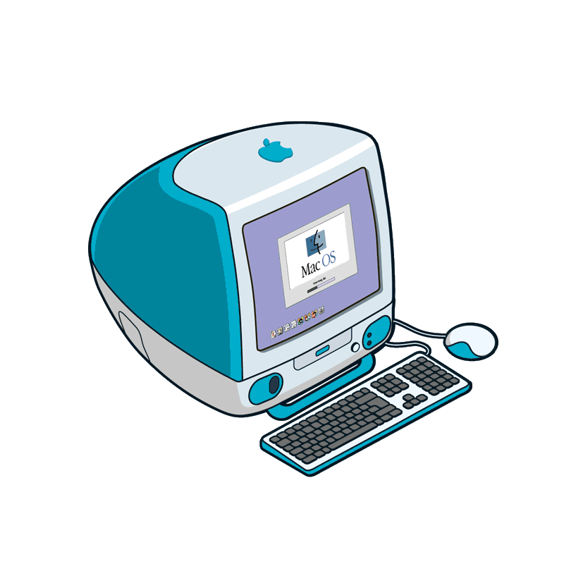
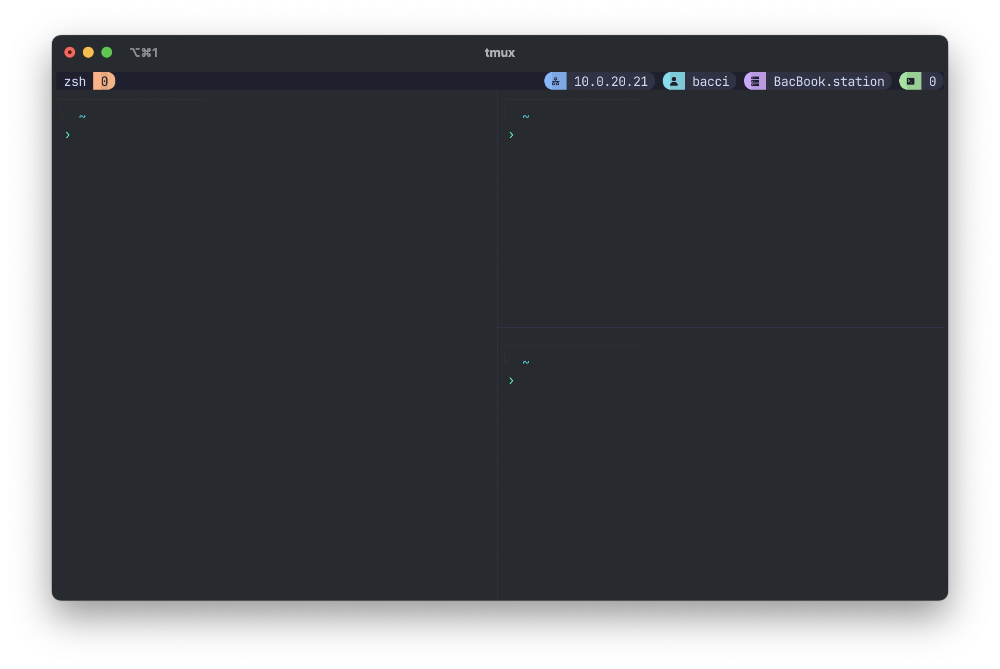

<!-- Improved compatibility of back to top link: See: https://github.com/othneildrew/Best-README-Template/pull/73 -->
<a id="readme-top"></a>
<!--
*** Thanks for checking out the Best-README-Template. If you have a suggestion
*** that would make this better, please fork the repo and create a pull request
*** or simply open an issue with the tag "enhancement".
*** Don't forget to give the project a star!
*** Thanks again! Now go create something AMAZING! :D
-->


<!-- PROJECT LOGO -->
<br />
<div align="center">
  <a href="https://github.com/GiovanniBaccichet/dotfiles-install">
    
  </a>

  <h3 align="center">dotfiles relay</h3>

  <p align="center">
    Installer for my private dotfiles
    <br />
    <a href="#Install"><strong>Quick Install »</strong></a>
    <br />
    <br />
    <a href="https://baccichet.org">About Me</a>
    ·
    <a href="https://github.com/GiovanniBaccichet/dotfiles-install/issues/">Report Bug</a>
    ·
    <a href="https://github.com/GiovanniBaccichet/dotfiles-install/issues/">Request Feature</a>
  </p>
</div>


## Introduction

This repository serves as my way to deploy my private dotfiles in a convenient manner, i.e. with a mnemonic command and and access token.



The installation script is designed also to easily replicate my CLI setup also in Unix remote VMs. This option won't install additional applications, rather only zsh, tmux and similar software, configuring also my aliases.

<p align="right">(<a href="#readme-top">back to top</a>)</p>

## Install

```bash
curl -fsSL dotfiles.baccichet.org/install.sh | bash
```

<p align="right">(<a href="#readme-top">back to top</a>)</p>
